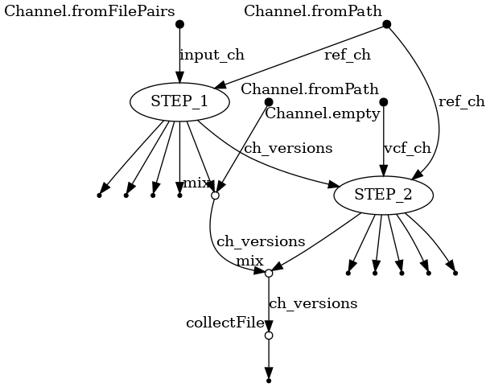

# vSNP3 Workflow
This Nextflow workflow is an implementation of [vSNP3](https://github.com/USDA-VS/vsnp3). See their GitHub repository for other uses that may not be implemented here.
<br>
<br>



*A schematic of the steps in the workflow.*

<br>

## Requirements
* Nextflow
* Docker or Singularity

<br>

## Install
```
git clone https://github.com/gregorysprenger/wf-vsnp.git
```

<br>

# Run Workflow
Example data and dependencies are included in assets/test_data directory.

```
nextflow run \
-profile singularity main.nf \
--inpath assets/test_data \
--refpath assests/test_data/refs \
--vcfpath assets/test_data/vcf \
--outpath results
```

Test data is from [USDA-VS /
vsnp3_test_dataset](https://github.com/USDA-VS/vsnp3_test_dataset).
```
# Obtain test data
git clone https://github.com/USDA-VS/vsnp3_test_dataset.git

# Move reference datafiles to assets/test_data/refs
mv vsnp3_test_dataset/vsnp_dependencies/Mycobacterium_AF2122/* wf-vsnp/assets/test_data/refs

# Move test files to assets/test_data
mv vsnp3_test_dataset/vsnp_dependencies/AF2122_test_files/step1/* wf-vsnp/assets/test_data

# Move VCF files to assets/test_data/vcf
mv vsnp3_test_dataset/vsnp_dependencies/AF2122_test_files/step2/* wf-vsnp/assets/test_data/vcf
```

<br>

## For Aspen Cluster - Set up Singularity PATH
```
# Add to $HOME/.bashrc
SINGULARITY_BASE=/scicomp/scratch/$USER
export SINGULARITY_TMPDIR=$SINGULARITY_BASE/singularity.tmp
export SINGULARITY_CACHEDIR=$SINGULARITY_BASE/singularity.cache
export NXF_SINGULARITY_CACHEDIR=$SINGULARITY_BASE/singularity.cache
mkdir -pv $SINGULARITY_TMPDIR $SINGULARITY_CACHEDIR
```
Reload .bashrc
```
source ~/.bashrc
```

Load nextflow
```
module load nextflow
```

<br>
